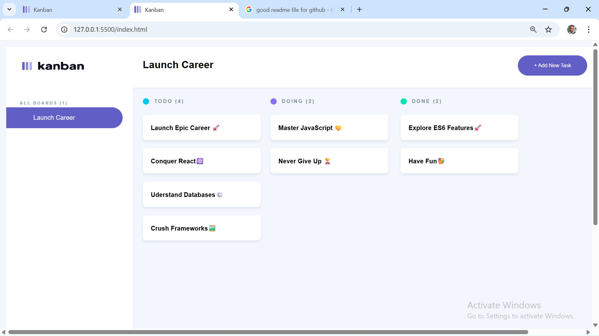
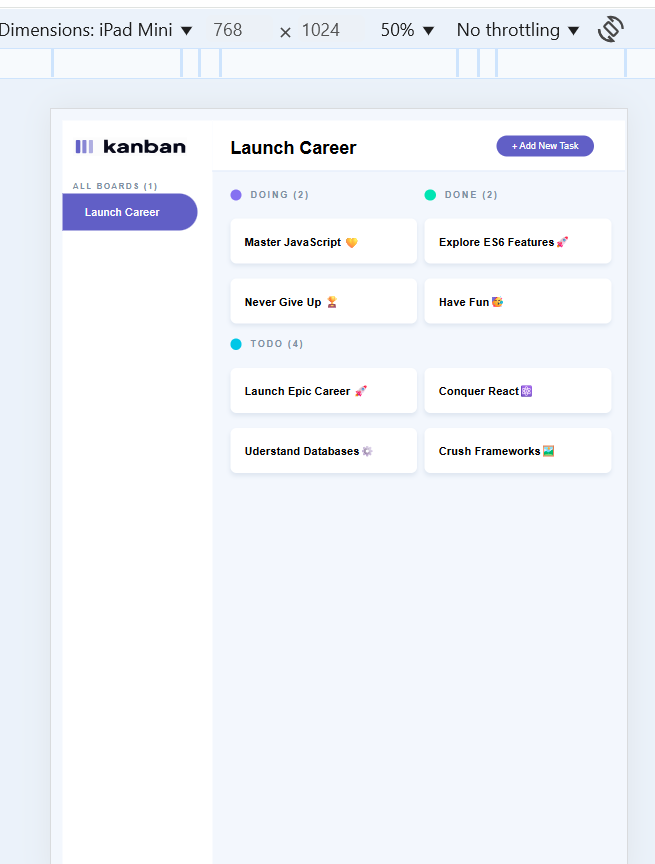
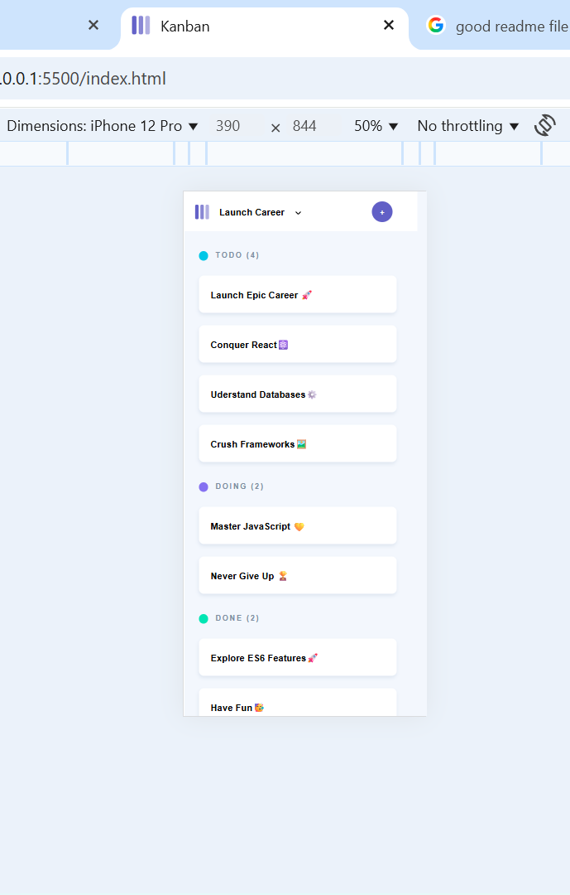

# Kanban Board UI Implementation
--

## Overview

This project involves developing a **fully responsive Kanban board**. The board should be structured into multiple columns and include task cards, a static side panel, and a well-defined theme to ensure a **professional and polished user experience.**

## Tools

- Text editor like VS Code.
- HTML for the structure.
- CSS for styling.

## Key Objectives

- Implement a **favicon and page title** that match the application’s theme for a professional look.
- Create a **Kanban board with multiple columns** (e.g., "To Do", "Doing", "Done").
- Ensure that the **board’s layout, colours, typography, and spacing** is visually consistant.
- Develop a **fully responsive** board that adapts seamlessly to **laptops, tablet and mobile devices**.
- Display **tasks as individual cards** within their respective columns, ensuring their design (borders, shadows, padding) are clear and appealing.
- Include **titles on all task cards** to provide clear task descriptions.
- Implement a **static side panel with** the correct **icons, text, and branding elements** for professional appearance.

## Outcome Images

